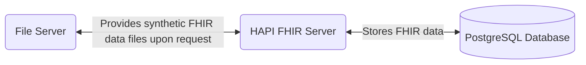
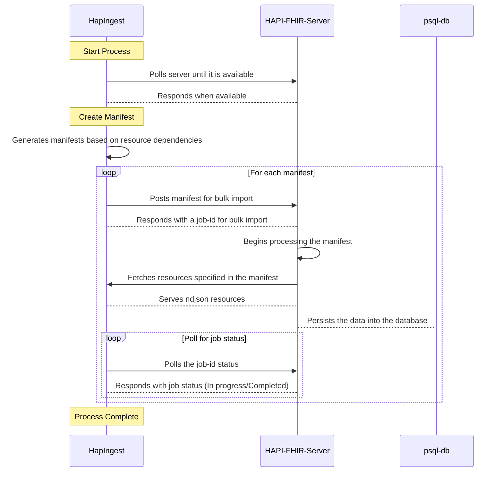

# HAPI FHIR Deployment with Synthetic Data

## Table of Contents

- [Overview](#overview)
- [Features](#features)
- [Prerequisites](#prerequisites)
- [Installation](#installation)
- [Usage](#usage)
  - [Starting the Server](#starting-the-server)
  - [Importing Synthetic Data](#importing-synthetic-data)
- [Configuration](#configuration)

## Overview

This repository provides a setup for deploying a HAPI FHIR server along with a database and a file server. The file server can be used to import synthetic FHIR data into the HAPI FHIR server.



### How it works

Here is a little sequence diagram explaining how it works.



## Features

- **HAPI FHIR Server**: A fully functional FHIR server using HAPI FHIR jpa-starter.
- **Database**: Pre-configured database to store FHIR data.
- **HAPIngest**: A specialized file server for importing synthetic FHIR data into the HAPI FHIR server.

## Prerequisites

- Docker and Docker Compose installed on your system.
- Syntetic data files or the ability to run a Java program to generate it

## Installation

1. Clone the repository:

   ```bash
   git clone https://github.com/CM1007-FHIR-DATA/deploy.git --recurse-submodules
   ```

2. Navigate to the project directory:

   ```bash
   cd deploy
   ```

3. Generate synthetic data, (replace 10 with the amount of patients to generate)

   ```bash
   cd synthea && \
   ./generate.sh 10 && \
   cp -R output/fhir/* ../fhir-data/ && \
   cd ..
   ```

4. Start the services using Docker Compose:

   ```bash
   docker compose up
   ```

## Usage

### Starting the Server

To start the HAPI FHIR server and hapingest-fileserver, use the following command:

```bash
docker compose up
```

The FHIR server will be accessible at `http://localhost:8080/fhir`.

### Importing Synthetic Data

1. Place your synthetic FHIR data files in the `fhir-data` directory.
2. Run `docker compose up`

## Configuration

Configuration options for the HAPI FHIR server, db and file server are located in the `docker-compose.yml` file.
